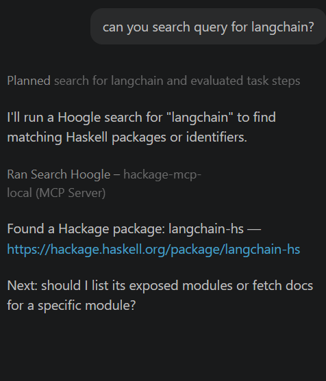
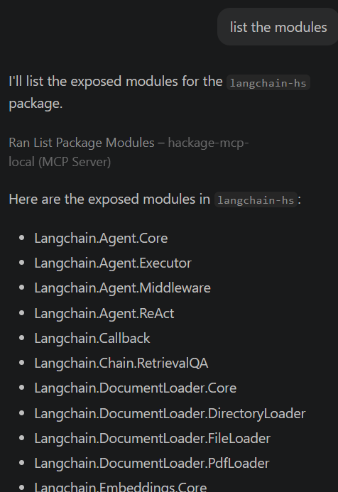
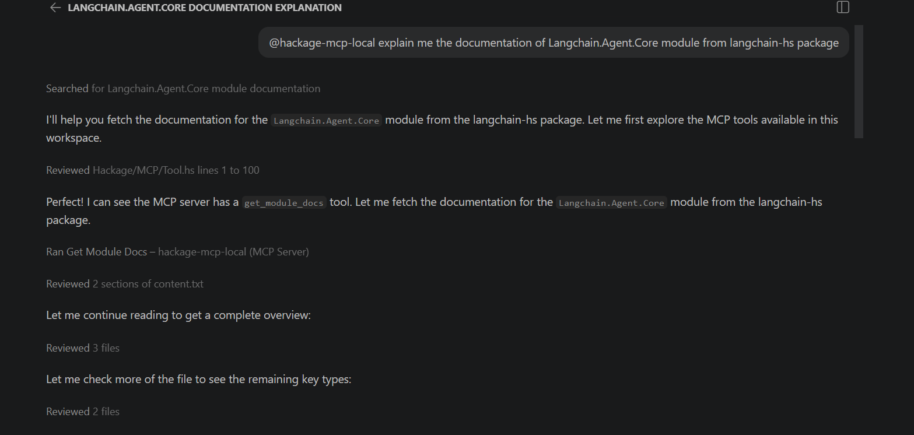

# hackage-doc-mcp

hackage-doc-mcp is an MCP server written in Haskell that lets AI agents query Hackage for:

- Hoogle searches
- Listing exposed modules of a package
- Fetching a module's Haddock documentation converted to compact, LLM-friendly Markdown

The server exposes an MCP-compatible stdio interface and implements the following tools:

- `search_hoogle` — search Hoogle for identifiers, types, or packages
- `list_package_modules` — list exposed modules of a Hackage package
- `get_module_docs` — fetch Markdown docs for a given package + module

## Quickstart

Prerequisites

- `docker` (for containerized runs)

Pull the latest Docker image from Docker Hub:

```bash
docker pull tusharknight8/hackage-doc-mcp:latest
```
VS Code MCP client configuration

Add an entry to your `mcp.json` pointing to the running server:

```json
{
	"servers": {
    "hackage-doc": {
     "type": "stdio",
      "command": "docker",
      "args": [
        "run", "-i", "--rm", "tusharknight8/hackage-doc-mcp:latest"
      ]
    }
  },
	"inputs": []
}
```

## Usage

### Screen captures

Below images are captured with VS code + github copilot.





## Development

- Build: `stack build`
- Run tests: `stack test`

## Contributing

Contributions are welcome. Please open issues or pull requests against the `develop` branch. When proposing changes, include:

- A short description of the change
- How to reproduce and test it locally

## Roadmap / TODO

- Improve Markdown conversion of module pages
- Add in-memory caching for fetched Hackage pages
- Add more robust scraping for different Hackage layouts

## License

This project is released under the MIT License. See the `LICENSE` file.

## Acknowledgements

- [haskell-mcp-server](https://github.com/drshade/haskell-mcp-server)
